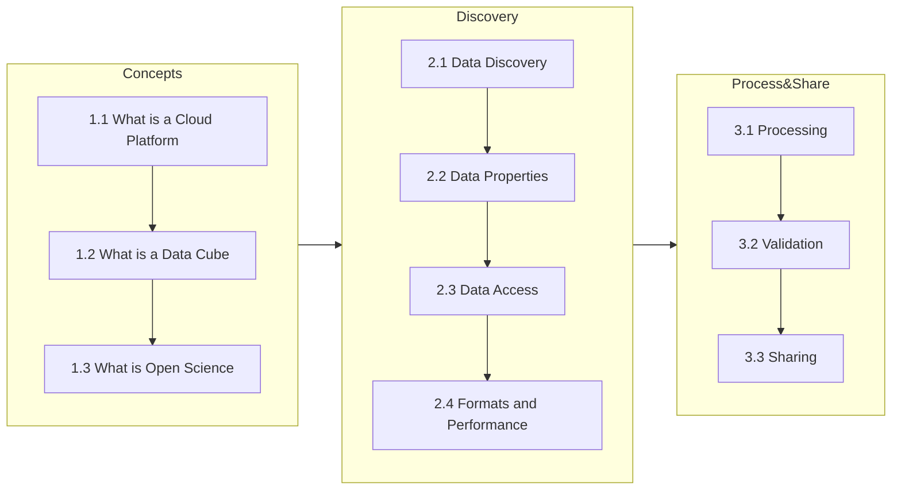

# Cubes, Clouds and Hazards
This is course material for the lecturs on Cubes, Clouds and Hazards which is based on the online course Cubes and Clouds (Zellener et al., 2024) but with main focus on Natural Hazards and Mapping those Hazards.

## Description
The physical lectures on **'Cubes, Clouds &amp; Hazards '** teaches the concepts of data cubes, cloud platforms and open science in the context of earth observation for monitoring Natural Hazards. Here is a great introduction about the concepts of cubes and clouds for earth observation:

https://user-images.githubusercontent.com/51962348/234564489-98a56dd2-1359-4972-ad3c-0f0f2d4b450e.mp4

### Content
The course explains the concepts of data cubes, EO cloud platforms and their use for natural hazard monitoring and mapping. 

### Learning Objectives
After finishing the participant will understand the theoretical concepts of cloud native EO processing and have gained practical experience by conducting an end-to-end EO workflow. The participant will be capable of independently using cloud platforms to approach EO related research questions and be confident in how to share research by adhering to the concepts of open science.

## License
 Where not stated explicitly otherwise this work is licensed under a <a rel="license" href="http://creativecommons.org/licenses/by/4.0/">Creative Commons Attribution 4.0 International License</a>.

## Acknowledgement
This course material is based on the work of Zellener et al (2024). 

Zellner, P. J., Dolezalova, T., Claus, M., Eberle, J., Balogun, R. O., Meißl, S., Eckardt, R., Hodam, H., Jacob, A., & Anghelea, A. (2024). Cubes & Clouds - Cloud Native Open Data Sciences for Earth Observation (v1.0.0). Zenodo. https://doi.org/10.5281/zenodo.10869466
